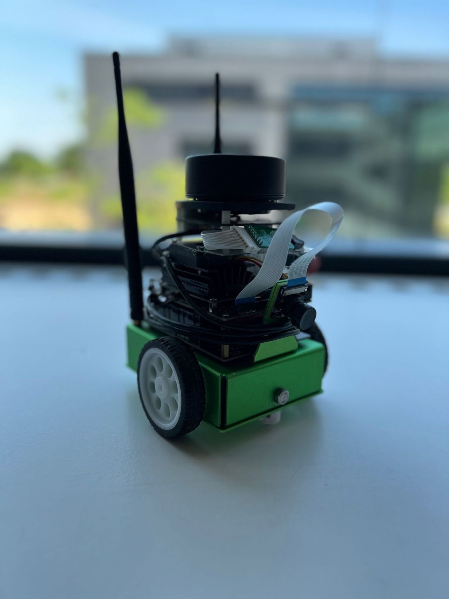
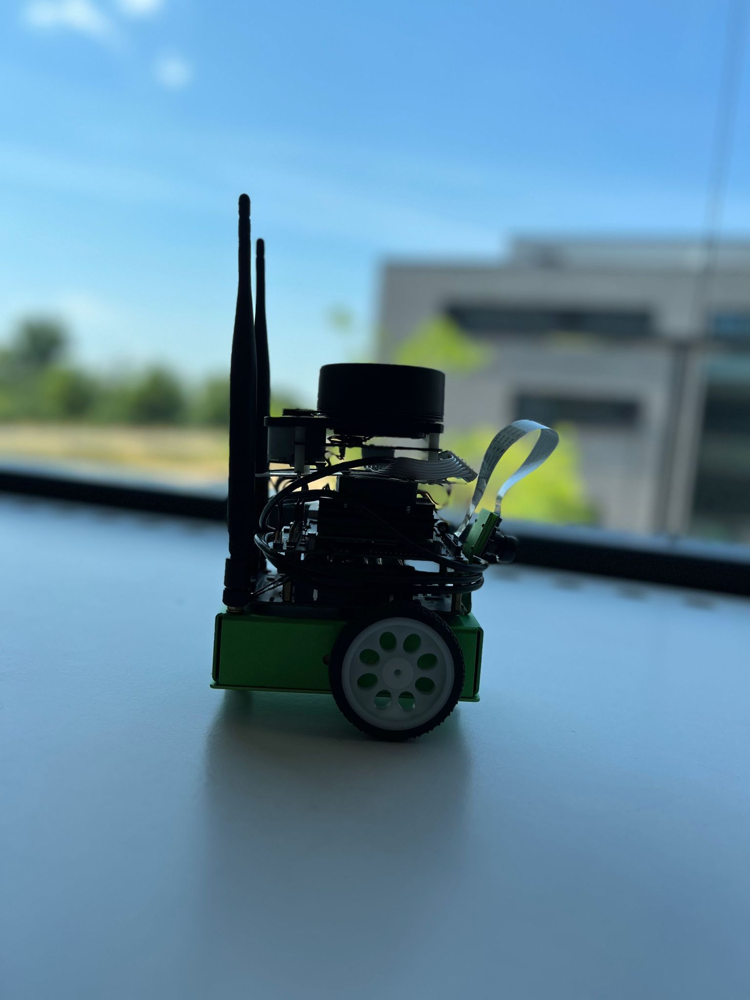
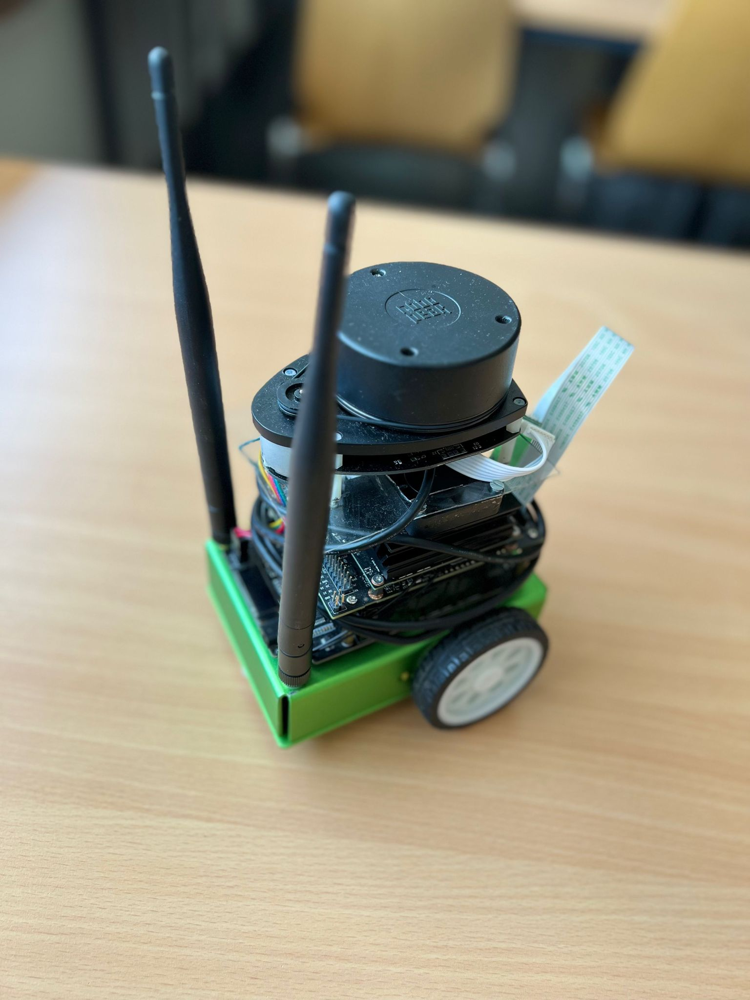
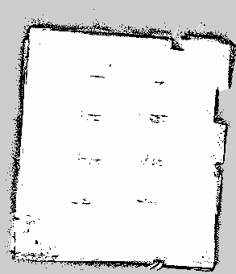
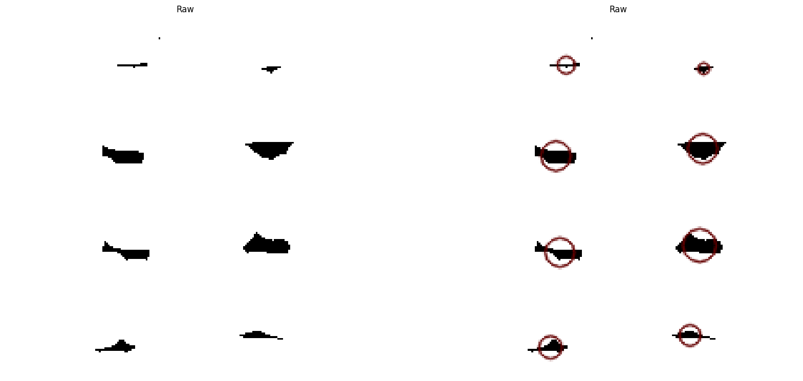
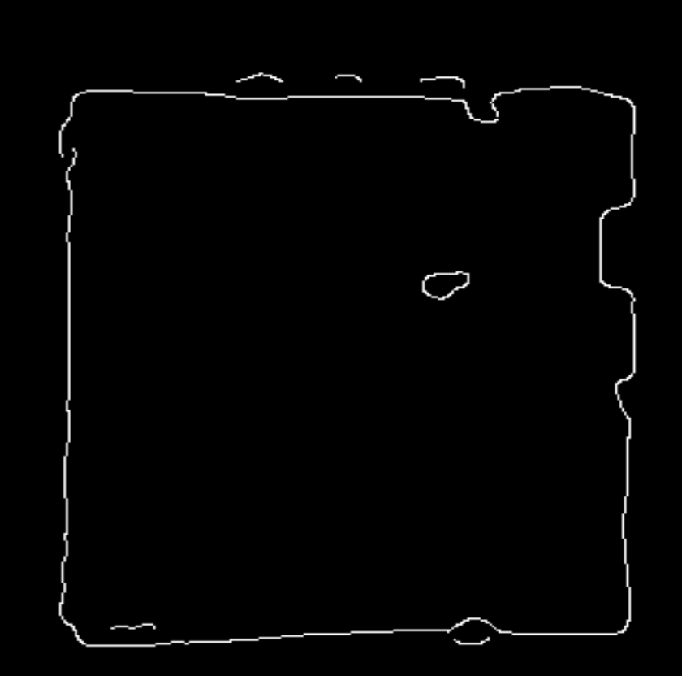
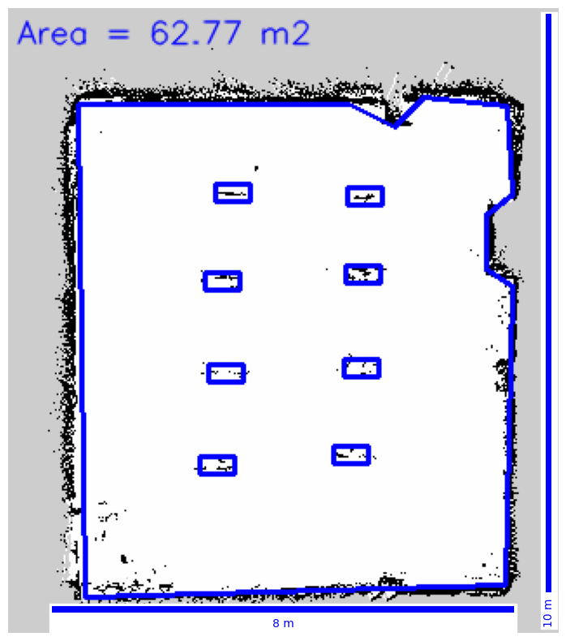

# Autonomous floor plan mapper with Jetbot AI
Use the nvidia jetbot kit to construct a floor plan autonomously.

> Fork of https://github.com/dusty-nv/jetbot_ros


<p float="left">
  
   
</p>
## 1. Initial Setup
Startup the jetbot and do the following basic setup:
### Start the JetBot ROS2 Foxy container

``` bash
git clone https://github.com/ThomasR155/jetbot_ros
cd jetbot_ros
docker/run.sh
```

### Run JetBot

Start the jetbot motors and camera:

``` bash
ros2 launch jetbot_ros jetbot_nvidia.launch.py
```

Then to run the following commands, launch a new terminal session into the container:

``` bash
sudo docker exec -it jetbot_ros /bin/bash
```
## 2. Navigation Model Setup

### Test Teleop

``` bash
ros2 launch jetbot_ros teleop_keyboard.launch.py
```

The keyboard controls are as follows:

```
w/x:  increase/decrease linear velocity
a/d:  increase/decrease angular velocity

space key, s:  force stop
```

Press Ctrl+C to quit.

### Train Navigation Model

Run this from inside the container, substituting the path of the dataset that you collected (by default, it will be in a timestamped folder under `/workspace/src/jetbot_ros/data/datasets/`)

``` bash
cd /workspace/src/jetbot_ros/jetbot_ros/dnn
python3 train.py --data /workspace/src/jetbot_ros/data/datasets/20211018-160950/
```


## 3. SLAM Setup

### Start Lidar
Install
[Rplidar Driver for ROS2](https://github.com/CreedyNZ/rplidar_ros2) (from source)


Make sure you have a suitable Lidar connected and mounted to your jetbot via USB just like that:

 

Then start the Lidar driver by running:

``` bash
ros2 run rplidar_ros rplidarNode 
```

### Calculate Odometry from Lidar
Install [rf2o_laser_odometry](https://github.com/MAPIRlab/rf2o_laser_odometry) (from source) 

Odometry will be started automatically, if you want to manually start it run:

``` bash
ros2 launch rf2o_laser_odometry rf2o_laser_odometry.launch.py 
```
## 4. Autonomous Mapping

### Start SLAM 
Install [slam_toolbox](https://github.com/SteveMacenski/slam_toolbox)

Place the robot in your room, make sure it's unblocked.

Run slam + odometry with the correct settings:

``` bash
ros2 launch jetbot_ros jetbot_custom_slam.launch.py
```

### Run Navigation Model

Use your custom trained model to navigate the room autonomously. Substitute the path to your model below:

``` bash
ros2 launch jetbot_ros nav_model.launch.py model:=/workspace/src/jetbot_ros/data/models/202106282129/model_best.pth
```

### Create Floor plan

create the floor plan by letting the robot navigate through the room autonomously:


[](https://www.youtube.com/watch?v=yZKvW5d6rJU)

[Full Demo Video on Youtube](https://www.youtube.com/watch?v=yZKvW5d6rJU)


### Save map finished map

``` bash
ros2 service call /slam_toolbox/save_map slam_toolbox/srv/SaveMap "name: data:'map.pgm'"
```

## 5. Postprocessing

### Load Map into Postprocessing.ipynb



### Preprocess the map with rotation, inverse, thresholding etc.

### Apply Blob detection inside the room to detect obstacles:


### Apply Edge detection to detect most outer edge and calculate its area (on inverse image):



### Construct final floor plan including outer edge, obstacles and calculated area:




## Acknowledgements
We would like to express our gratitude to Prof. Dr. Patrick Glauner for giving very interesting lectures and providing the hardware for this project.


Project team: Thomas Riedl, Leon Madest, Darwin Sucuzhañay and Ankit Singh Rawat


[LinkedIn Post](https://www.linkedin.com/feed/update/urn:li:activity:7087667723597406208/)
